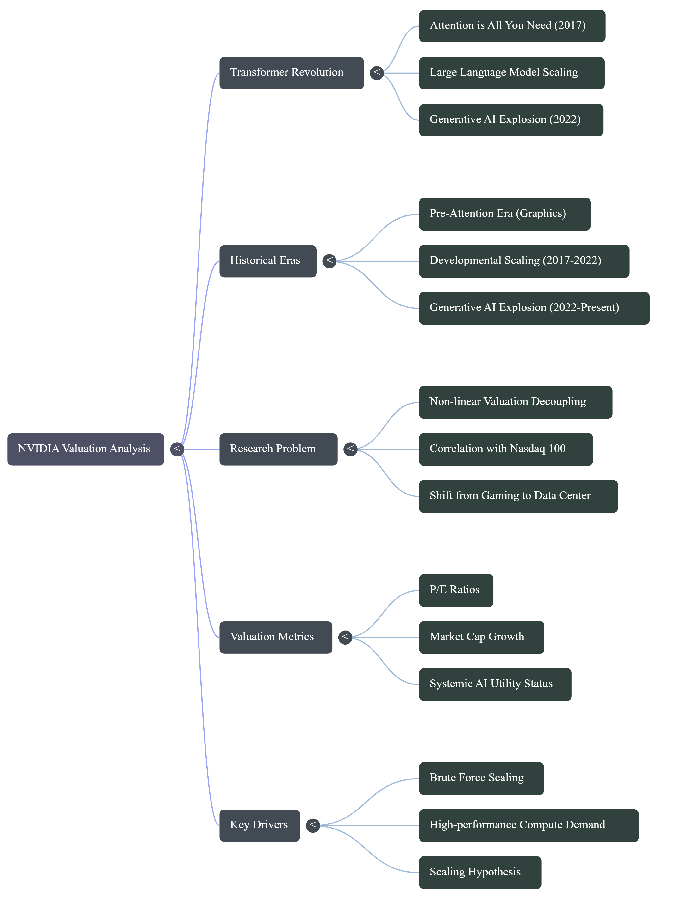

# NVIDIA-evaluation-and-AI-breakthroughs-analysis
Comprehensive analytical evaluation of NVIDIA's market performance and its correlation with major architectural breakthroughs in AI and the Scaling Hypothesis.

Title: NVIDIA evaluation and AI breakthroughs analysis

Team members and roles:

* **Pattasavich Meenandhavech**: Team Lead, Report
* **Agathiyan Akilan**: Descriptive Analyst
* **Tony Nicholas Panneer Jesuraja**: Diagnostic Analyst
* **John Fel Maulion**: Data Engineer

Introduction:

The publication of the seminal paper "Attention is All You Need" in 2017 introduced the Transformer architecture, marking a fundamental shift in the trajectory of Artificial Intelligence. Prior to this breakthrough, NVIDIA was primarily valued as a leader within the cyclical gaming and graphics industry. However, the emergence of Transformers pivoted the industry toward the "brute force" scaling of Large Language Models (LLMs), a trend that reached a global proof-of-concept with the release of ChatGPT in late 2022. This milestone triggered an unprecedented surge in demand for high-performance compute, necessitating a re-evaluation of NVIDIA’s market position. NVIDIA’s stock price has surged by 1,100 % since the introduction of ChatGPT in late 2022. To understand this evolution, NVIDIA’s performance is analyzed across three distinct epochs: the Pre-Attention Era (traditional graphics), the Developmental Scaling Era (2017–2022), and the Generative AI Explosion (2022–Present).

Problem Statements:

Despite its long-standing presence in the semiconductor market, NVIDIA’s valuation has recently undergone a non-linear decoupling from broader technology benchmarks, such as the Nasdaq 100. The core academic problem lies in quantifying how major milestones in AI architecture—specifically the transition from traditional neural networks to Transformer-based scaling—served as the primary causal driverse for NVIDIA's stock price appreciation and the transformation of its revenue mix.

Research Questions:
1.	How has the correlation between NVIDIA and the Nasdaq 100 evolved as the company’s revenue model transitioned from being gaming-centric to data center-centric?
2.	To what extent did the "Scaling Hypothesis" (post-2017) facilitate a fundamental shift in valuation metrics, such as P/E ratios and Market Cap, when compared to the pre-Attention period?
3.	Can data analytics pinpoint a specific "inflection point" where the market transitioned from viewing NVIDIA as a hardware vendor to pricing it as a systemic AI utility?
4.	How did the shift toward "brute force" scaling of LLMs following the 2017 architectural breakthrough alter NVIDIA's long-term valuation trajectory relative to its historical cyclicality?
5.	What impact did the 2022 ChatGPT release have as a global proof-of-concept in accelerating the demand for NVIDIA’s high-performance compute resources?

Mini Mind Map:

