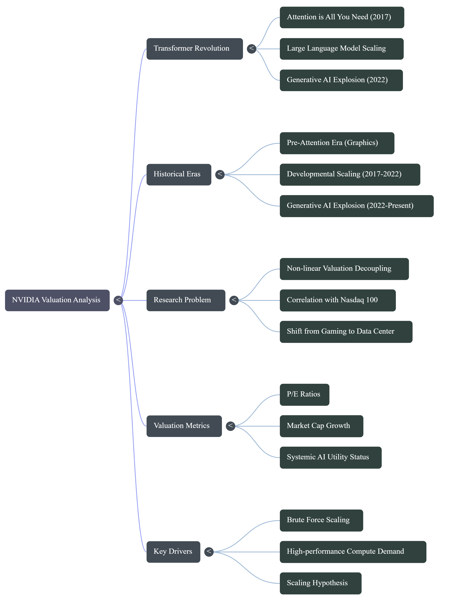

# NVIDIA Evaluation and AI Breakthroughs Analysis

A reproducible, data-driven study of **NVIDIA's market performance and earnings from 2010 to 2026**, examined alongside three milestones in AI architecture: convolutional neural networks (AlexNet, 2012), attention-based Transformers (*Attention Is All You Need*, 2017), and the generative-AI wave catalysed by ChatGPT (late 2022).

> **Framing note: this study is descriptive and diagnostic, not causal.** It documents *temporal alignment*: where structural shifts in NVIDIA's price, earnings, and revenue mix line up in time with AI milestones. It does **not** claim those milestones *caused* the shifts. Where the text uses language like "driven by" or "accompanied," read it as association, not proof of causation. Isolating causation would require controls and counterfactuals that are outside this project's scope.

---

## Overview

Before 2017, NVIDIA was valued largely as a leader in the cyclical gaming and graphics market. The Transformer architecture (2017) shifted the AI field toward large-scale "brute-force" training of language models, and ChatGPT (late 2022) served as a global proof-of-concept that triggered an unprecedented surge in demand for high-performance compute. Over the window we study, NVIDIA's split-adjusted quarter-end price rose roughly **1,100% (about 12×)**, from $14.58 at the end of 2022Q4, the quarter ChatGPT launched, to $174.20 in 2026Q1 (figures as of the 2026Q1 data cut).

This project asks whether NVIDIA's price, earnings, and revenue mix exhibit a *structural change* that aligns, in time, with these AI milestones, and if so, which milestone the change lines up with most cleanly. NVIDIA is analysed across three eras: a **Pre-Attention / CNN** era (2010–2017), the **developmental scaling / Transformer** era (2017–2022), and the **generative-AI** era (2022–present), and is compared against semiconductor peers (AMD, Intel) and market benchmarks (Nasdaq-100, PHLX Semiconductor Index).

## Research Questions

1. How has NVIDIA's return correlation with its peers (AMD and Intel) and the Nasdaq-100, along with its divergence from them in price and revenue, evolved as the company's revenue model shifted from gaming-centric to data-center-centric?
2. Do NVIDIA's split-adjusted price, revenue, and net income exhibit statistically detectable structural breaks (inflection points), and where do those breaks fall in time relative to the three AI milestones?
3. How did NVIDIA's revenue mix (Gaming → Data Center), margin structure, and share of the combined NVDA/AMD/Intel revenue pool shift across the three eras?
4. How does NVIDIA's price and earnings trajectory after the 2017 architectural shift compare with its earlier gaming-era cyclicality?
5. How does the timing of the 2022 ChatGPT release (and the earlier AlexNet and Transformer milestones) line up with changes in NVIDIA's revenue, revenue mix, and margins, and with the hyperscaler capital-expenditure backdrop?

## Data

Three independent sources produce five analysis-ready datasets, all covering 2010–2026.

| Source | What it provides | Datasets |
|---|---|---|
| **SEC EDGAR** (XBRL company-facts API) | Quarterly fundamentals (revenue, gross/operating/net income, diluted EPS & shares) for NVDA, AMD, INTC; capital expenditure for the hyperscalers (MSFT, GOOGL, AMZN, META) | `sec_fundamentals_wide.csv`, `sec_fundamentals_long.csv` |
| **Yahoo Finance** (via `yfinance`) | Split/dividend-adjusted daily prices and quarter-end series for NVDA, AMD, INTC and the ^NDX / ^SOX indices | `yahoo_prices_daily.csv`, `yahoo_prices_quarterly.csv` |
| **NVIDIA 10-K filings** (hand-collected) | Annual revenue by reportable segment (Gaming, Data Center, Professional Visualization, OEM & Other), FY2013–FY2025 | `nvda_segments_annual.csv` |

These feed a single unified quarterly panel, `master_quarterly_panel.csv`, which every analysis reads from. An audit artifact, `sec_completeness_report.csv`, records coverage and any gaps per company/metric.

All generated CSVs are committed to the repository, so the analysis can be reproduced **without re-running the pipeline** (see *Reproducing the project*).

## Repository structure

```
.
├── Source/                       # the data pipeline (reusable engine)
│   ├── sec_edgar_ingest.py       #   SEC EDGAR fundamentals + hyperscaler capex
│   ├── yahoo_prices_ingest.py    #   Yahoo Finance prices & indices
│   ├── segments_ingest.py        #   NVIDIA revenue by segment (annual)
│   ├── join_quarterly.py         #   merge sources -> master quarterly panel
│   ├── run_pipeline.py           #   orchestrator: runs all four in order
│   └── logging_config.py         #   shared logging setup
├── Data/
│   ├── inputs/                   # curated manual sources (segment CSV)
│   ├── outputs/                  # generated datasets (committed)
│   └── sec_cache/                # SEC API response cache (gitignored)
├── descriptive analysis/         # descriptive notebook + figures/ + findings/
├── diagnostic analysis/          # diagnostic notebook + figures/ + findings/
├── Documentation & Reports/      # methodology document and write-ups
├── Logs/                         # pipeline run logs
├── Archive/                      # legacy / superseded material
├── requirements.txt              # dependencies (version floors)
├── requirements.lock             # exact pinned versions (pip freeze)
├── LICENSE                       # MIT
├── mindmap.png                   # project mind map
└── README.md
```

The design separates a **reusable engine** (`Source/`) from the **analyses that consume it** (the two analysis folders). There is one source of truth for data (`Data/`); the analyses read the shared panel rather than carrying their own copies.

## Setup

**Prerequisites:** Python 3.10+ (tested on 3.12) and Git.

```bash
git clone https://github.com/TheCuriousMind2017/Data-Analytics-60-NVIDIA-evaluation-and-AI-breakthroughs-analysis.git
cd Data-Analytics-60-NVIDIA-evaluation-and-AI-breakthroughs-analysis

python -m venv venv
# Windows:
venv\Scripts\activate
# macOS/Linux:
source venv/bin/activate

pip install -r requirements.txt
```

For an environment that exactly matches the one the project was built in, install from the lock file instead: `pip install -r requirements.lock`.

## Reproducing the project

There are two paths. Choose based on whether you want to rebuild the data or just work with it.

### Path A: from the committed data (no network)

Every dataset is already in `Data/outputs/`, so you can go straight to the analysis. Open the notebooks in `descriptive analysis/` and `diagnostic analysis/`; they read the committed `master_quarterly_panel.csv` and `nvda_segments_annual.csv`. No API access required.

### Path B: rebuild everything from source

This re-pulls from SEC EDGAR and Yahoo Finance and regenerates all datasets.

**SEC requires a contact.** SEC's fair-access policy requires every request to carry a User-Agent identifying who is making it. Set yours once (the project never hard-codes one):

```bash
# Windows (PowerShell)
$env:SEC_IDENTITY = "Your Name your@email.com"
# macOS/Linux
export SEC_IDENTITY="Your Name your@email.com"
```

Then run the whole pipeline from the repo root:

```bash
python Source/run_pipeline.py
```

The orchestrator runs the four stages in dependency order (`sec → yahoo → segments → join`) and stops if any stage fails. Useful variants:

```bash
python Source/run_pipeline.py --skip sec,yahoo   # rebuild only the local steps (no network)
python Source/run_pipeline.py --only segments    # run a single stage
```

Each stage also runs standalone (e.g. `python Source/segments_ingest.py`) and ships with an offline self-test (`--selftest`) that validates its logic against synthetic fixtures without any network access.

## The data pipeline

The three sources are ingested by independent scripts (so each has its own failure mode and update cadence) and unified only at the join step. Highlights:

- **SEC EDGAR**: pulls the bulk company-facts JSON once per company (disk-cached in `Data/sec_cache/`), reconciles inconsistent XBRL tags across filers and accounting-standard changes, derives Q4 figures (rarely filed standalone), and aligns everything to calendar quarters.
- **Yahoo Finance**: fetches split/dividend-adjusted daily closes, resamples to quarter-ends, and computes quarter-over-quarter returns and a base-100 price index.
- **NVIDIA segments**: recomputes each segment's share from raw dollars (rather than trusting transcribed percentages), derives an "unallocated" band so shares always sum to 100%, and maps NVIDIA's fiscal years to calendar years.
- **Join**: outer-merges the sources on a `YYYYQn` key, adds trailing-twelve-month and year-over-year series, and carries provenance for every value.

All stages log to `Logs/` and the console through a shared logging configuration.

## Analysis

The analysis is split into two notebooks that both read the unified panel:

- **Descriptive** *(what happened)*: price, revenue, and net-income trajectories, peer divergence, margin expansion, and revenue-mix and revenue-share evolution.
- **Diagnostic** *(what it lines up with)*: structural-break (inflection-point) detection on price, revenue, and net income, era-by-era comparisons, and hypothesis tests on the research questions.

The work is organised around six analytical pillars: (1) structural breaks, (2) peer divergence, (3) revenue mix, (4) margin expansion, (5) competitive share & return co-movement, and (6) capex linkage between hyperscaler spending and NVIDIA's data-center revenue. Figures are generated reproducibly from the panel; their interpretation is the analysts' own.

## Methodology notes

- **Non-causal by design.** The claim throughout is *temporal alignment*: a structural break in NVIDIA's series that coincides with an AI milestone, not proof that the milestone caused it. A headline finding: NVIDIA's Data Center revenue overtakes Gaming in fiscal-year 2023, which maps to **calendar 2022, the ChatGPT year**.
- **NVIDIA fiscal-year mapping.** NVIDIA's fiscal year ends in late January, so fiscal year *n* corresponds to roughly calendar year *n − 1* (e.g. FY2023 ≈ calendar 2022). This mapping is applied consistently so segment data lines up with the price/earnings timeline.
- **Era definitions.** Pre-Attention / CNN (2010Q1–2017Q2), Transformer (2017Q3–2022Q3), and Generative-AI (2022Q4–2026Q1), with the AlexNet milestone (2012Q3) annotated within the first band.
- **Known data-quality notes.** Early NVIDIA segment years carry a sizeable "unallocated" band (categories not separately disclosed), and one figure (FY2016/FY2017 Data Center) is flagged as a possible transcription duplicate pending verification against the source 10-K. Hyperscaler coverage in the panel is capital-expenditure only; their revenue and margins are intentionally not pulled.

For the full methodology (ingestion architecture, the technical challenges encountered, and how each was resolved), see `Documentation & Reports/`.

## Team

| Member | Role |
|---|---|
| **Pattanasavich Meenandhavech** | Team Lead · Data Pipeline · Synthesis & Final Report |
| **Agathiyan Akilan** | Descriptive Analyst |
| **Tony Nicholas Panneer Jesuraja** | Diagnostic Analyst |

## License and data

This project is released under the **MIT License** (see [`LICENSE`](LICENSE)).

Data sources retain their own terms: SEC EDGAR filings are public domain; Yahoo Finance data is retrieved via `yfinance` and is subject to Yahoo's terms of use (used here for research and educational purposes); NVIDIA segment figures are transcribed from public 10-K filings. This repository redistributes derived/aggregated data for reproducibility; consult each provider for any reuse beyond research.

## Mind map


